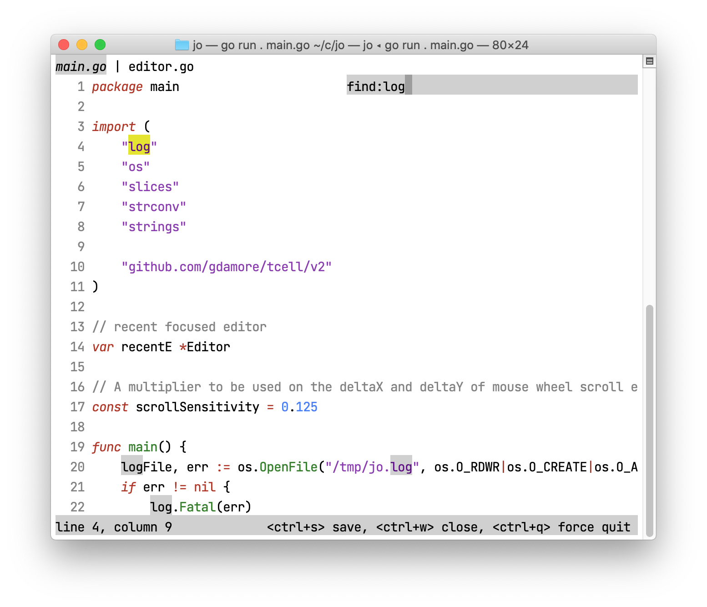
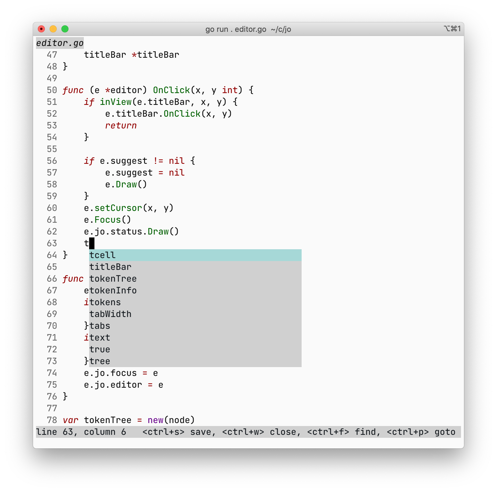

The code implements a text editor that supports the following features:
- syntax highlighting
- search
- tabs
- go to any file or line
- code completion
- split view
- undo and redo

The implementation depends on [tcell](https://github.com/gdamore/tcell),
so it works in the terminal, but draws the UI from scratch 
and manages focus, click, hover and popup itself.

Here are the screenshots:

