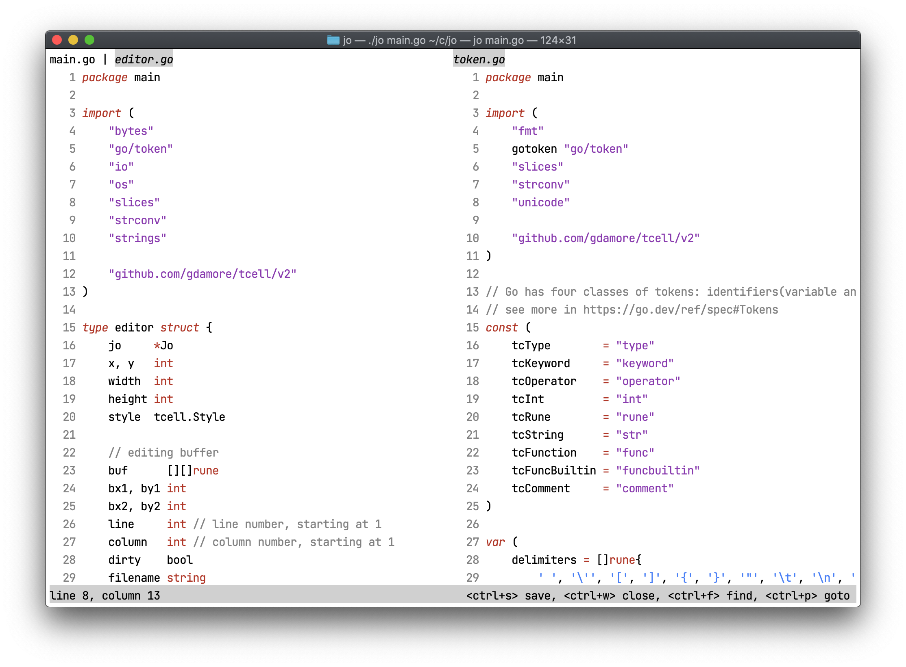

# Jo

Jo is a text editor written for fun, consisting of 2,000 lines of code 
and the following functionalities:
- syntax highlighting
- search
- tabs
- go to any file
- code completion
- split view
- select words on multiple click

Writing user interface has been an interesting challenge for me, 
making me rethink and reimplement view, focus, click, hover and popup. 

## Credit
Jo depends on [tcell](https://github.com/gdamore/tcell)
